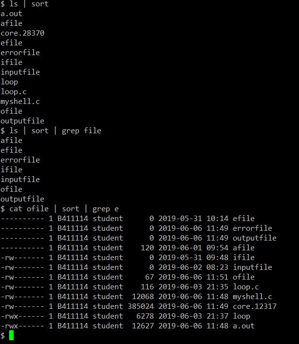

My Shell in LINUX
====================

- - -
This is a C-based shell program that operates in a LINUX environment. (not using system() function)
> All commands are separated by 1 spacebar.  
> Support "-c" option. 
> Support Background Job (ex. Use "&" symbol such as "grep file &") 
> Support I/O Redirection (ex. Use "<",">","2>" symbol such as "example < infile > outfile 2> errorfile") 
> Support (multi)Pipe IPC (ex. Use "|" symbol such as "ls | sort") 
- - -

- - -
BackgroundJob
-----------------

- - -
I/O Redirection
-----------------

- - -
multiPIPE
-----------

- - -
